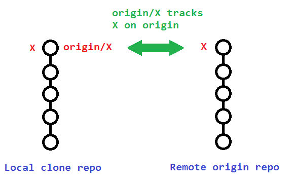
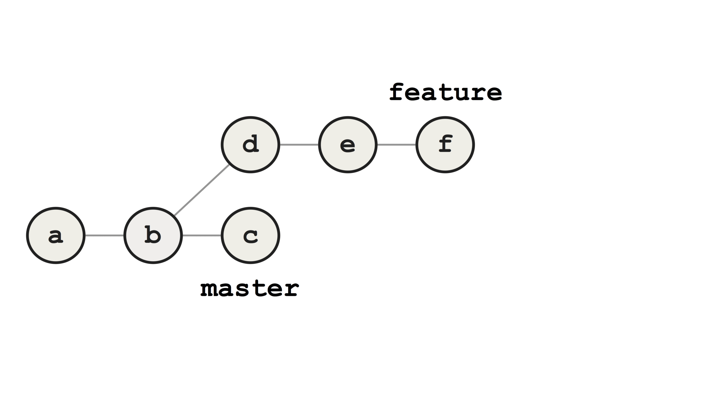
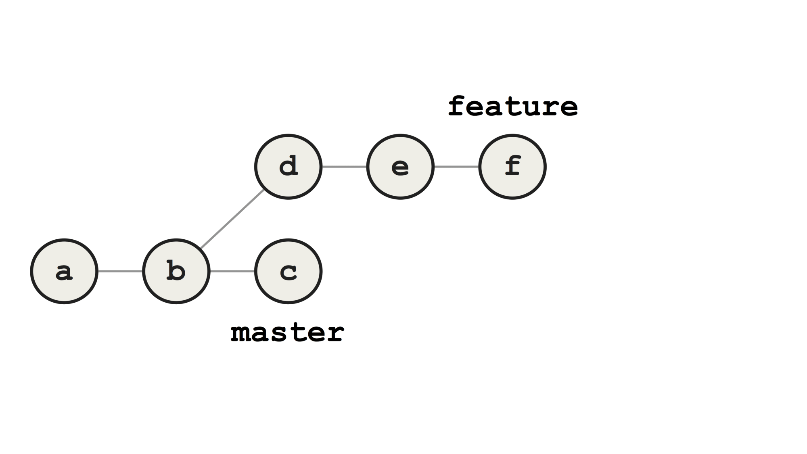

layout: true
class: center
---

# Fun with git

--

## Understanding git

--

## Rebasing

--
## Usefull git tips & tricks

--

## Discussion

---

# git is decentralized



???

* git remote show origin - show in console
* fetch vs pull
* Working with local branches has benefits like rebasing before pushing
* Think of them as bookmarks, to remind you where the branches in your remote repositories were the last time you connected to them.

---

# Tip #1 - New branch

## Create local branch

```git
git checkout -b us/123
```

--

## push branch to remote and set tracking branch

```git
git push -u origin us/123
```

---

# The good commit


---

# The seven rules of great commit message

#### 1. Separate subject from body with a blank line
#### 2. Limit the subject line to 50 characters
#### 3. Capitalize the subject line
#### 4. Do not end the subject line with a period
#### 5. Use the imperative mood in the subject line
#### 6. Wrap the body at 72 characters
#### 7. Use the body to explain what and why vs. how


#### https://chris.beams.io/posts/git-commit

---

.left[
```
Summarize changes in around 50 characters or less

More detailed explanatory text, if necessary. Wrap it to about 72
characters or so. In some contexts, the first line is treated as the
subject of the commit and the rest of the text as the body. The
blank line separating the summary from the body is critical (unless
you omit the body entirely); various tools like `log`, `shortlog`
and `rebase` can get confused if you run the two together.

Explain the problem that this commit is solving. Focus on why you
are making this change as opposed to how (the code explains that).
Are there side effects or other unintuitive consequences of this
change? Here's the place to explain them.

Further paragraphs come after blank lines.

 - Bullet points are okay, too

 - Typically a hyphen or asterisk is used for the bullet, preceded
   by a single space, with blank lines in between, but conventions
   vary here

If you use an issue tracker, put references to them at the bottom,
like this:

Resolves: #123
See also: #456, #789
```
]

---

## Rebasing

--

### "With the rebase command, you can take all the changes that were committed on one branch and replay them on another one."

#### - https://git-scm.com/book/en/v2/Git-Branching-Rebasing

---

# Why rebase?

--

## To delete the crm_tmp commit

--

OR

## To create a linear commit history in the repository

--

OR

## To cleanup commits in feature branch before merging

---

# Merging feature to master



---

# Rebasing feature onto master



--

Or not
https://medium.com/@fredrikmorken/why-you-should-stop-using-git-rebase-5552bee4fed1

---

# Rebase to avoid messy commits 

### "changes from code review"
### "fixed typo in error message"

### "If you treat rebasing as a way to clean up and work with commits before you push them, and if you only rebase commits that have never been available publicly, then you’ll be fine"

#### - https://git-scm.com/book/en/v2/Git-Branching-Rebasing

???

Who uses rebase for something OTHER THAN to remove the crm_tmp commit?

---

class: center, middle
# Live rebasing


???

Live example in gitfun repo 

branch feature/fun

```git
git show HEAD HEAD~1 --format=oneline
```

```git
git rebase -i HEAD~2
```

---
class: center, middle
## Tip #2 - Default editor

### Tired / afraid of Vim? Run latest git installer and select default editor of choice

---

#Discussion

--

## If your branch has been pushed but nobody else has used it, is it okay to rebase and force push?

--

## Should we squash commits when merging PR?

--

## What is a good commit / commit message?

---
# Tip #3 - Aliases

.left[```git
st = status
```]

.left[```git
incoming = !git fetch && git log --pretty=oneline --abbrev-commit --graph ..@{u}
```]

.left[```git
outgoing = log --pretty=oneline --abbrev-commit --graph @{u}..
```]

???
How many has at least one alias in their git config?
Has anyone used mercurial?

## Amend last commit
typo in commit message?
`git commit --amend`

Forgot to add a file in commit?
git add ./forgotten-file.txt
git commit --amend
